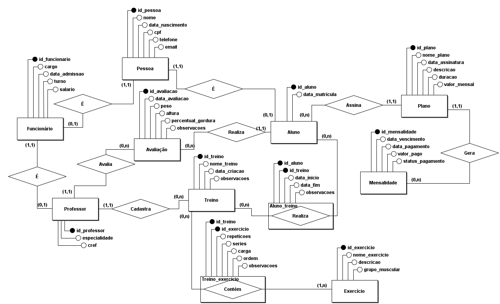

# GymFlow - Sistema de Gestão de Academia

GymFlow é um sistema desenvolvido para o trabalho de POO1 do curso de Tecnologia em Análise e Desenvolvimento de Sistemas. Feito em Java para auxiliar na gestão de academias. Ele oferece funcionalidades para gerenciar alunos, funcionários, planos de treino, pagamentos e outras informações relevantes para o funcionamento de uma academia.

## Funcionalidades Principais

* **Gerenciamento de Pessoas:** Cadastro e controle de informações de alunos, funcionários e professores.
* **Planos de Treino:** Criação e atribuição de treinos personalizados para alunos.
* **Avaliações Físicas:** Registro e acompanhamento de avaliações físicas dos alunos.
* **Controle de Mensalidades:** Gestão de pagamentos e mensalidades dos alunos.
* **Gerenciamento de Funcionários:** Controle de informações de funcionários e professores.

## Tecnologias Utilizadas

* **Java:** Linguagem de programação principal.
* **Maven:** Ferramenta de gerenciamento de dependências e build.
* **SQLite:** Banco de dados relacional.
* **JDBC:** API para conexão com o banco de dados.
* **HikariCP:** Pool de conexões JDBC para otimizar o acesso ao banco de dados.
* **SLF4J:** Facade para logging.

## Pré-requisitos

* JDK 21 ou superior instalado.
* Maven 3.6.0 ou superior instalado.

## Como Executar

1.  **Clonar o Repositório:**

    ```bash
    git clone https://github.com/brunopavese/GymFlow.git
    cd gymflow
    ```

2.  **Instalar as Dependências:**

    ```bash
    mvn clean install
    ```

3.  **Criar o Banco de Dados:**

    ```bash
    mvn exec:java@create-database
    ```
4.  **Executar a Aplicação:**

    ```bash
    mvn exec:java@run
    ```

    * **Observação:** Certifique-se de que a classe principal da sua aplicação está corretamente configurada no arquivo `pom.xml`.

## Estrutura do Projeto

A estrutura do projeto segue o padrão MVC (Model-View-Controller):

* `com.uerj.gymflow.model`: Classes que representam os dados.
* `com.uerj.gymflow.view`: Classes responsáveis pela interação com o usuário.
* `com.uerj.gymflow.controller`: Classes que controlam o fluxo da aplicação e interagem com o model e a view.
* `com.uerj.gymflow.dao`: Classes que realizam o acesso ao banco de dados (Data Access Objects).
* `com.uerj.gymflow.database`: Classes de criação e conexão do banco de dados.

## Diagrama ER




## Autores

* Anderson Rodrigues
* Bruno Pavese Leite
* Emanuely da Rosa Colodete Antonio
* Yan dos Santos Cedro